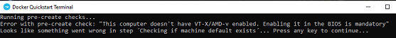
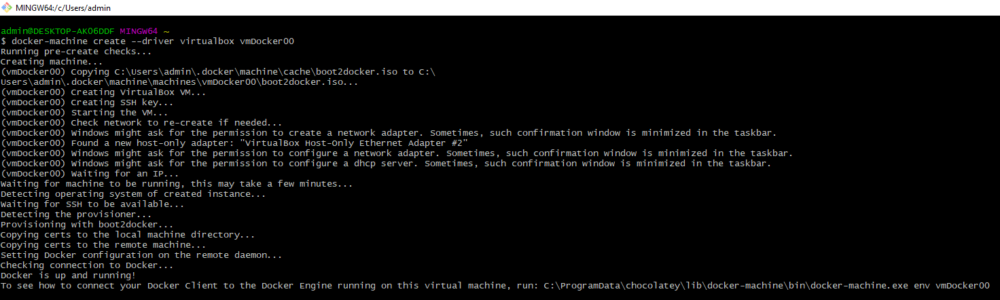
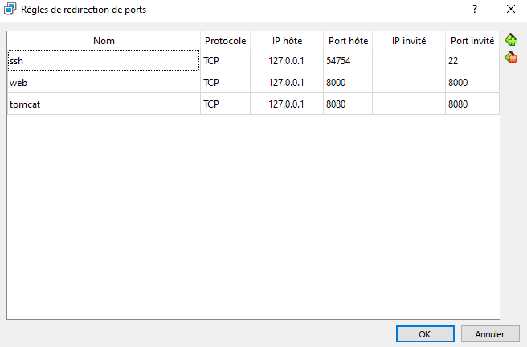
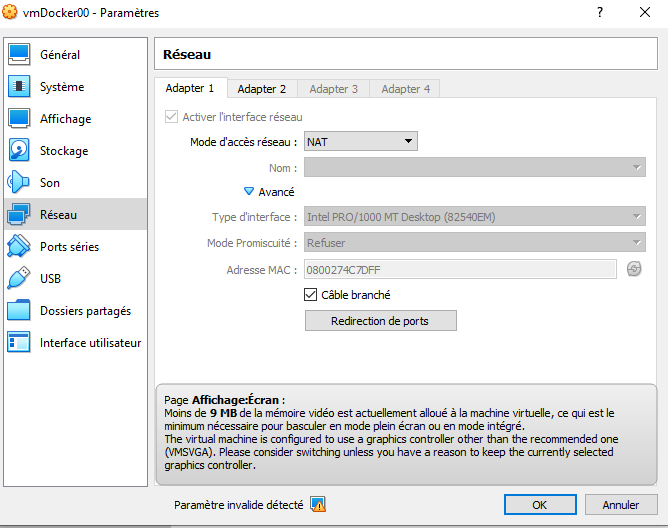
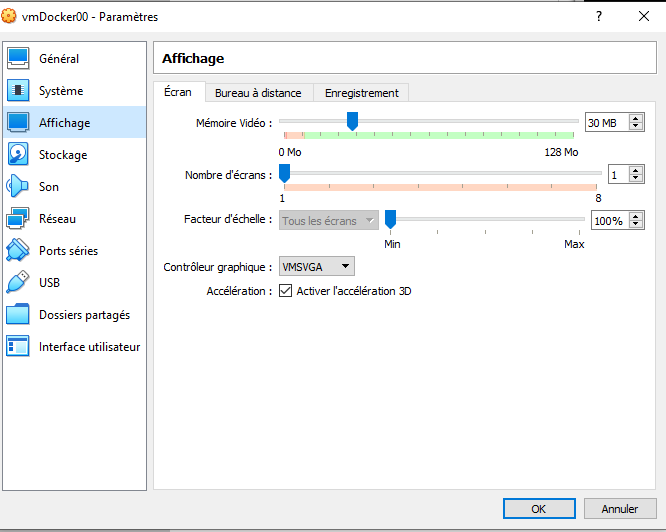
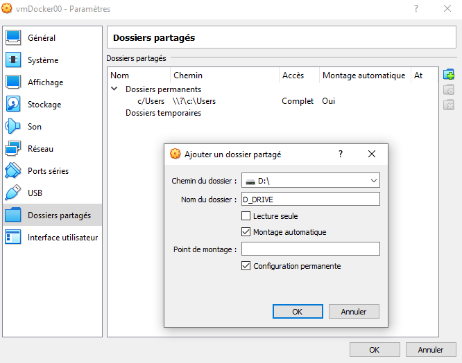
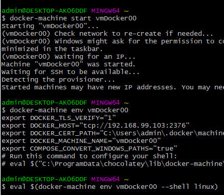

# Docker_Kubernetes 

Docker est:

* Flexible : même les applications les plus complexes peuvent être conteneurisées.
* Léger : les conteneurs exploitent et partagent le noyau hôte, ce qui les rend beaucoup plus efficaces en termes de ressources système que les machines virtuelles.
* Portable : vous pouvez créer localement, déployer sur le cloud et exécuter n'importe où.
* Couplage faible : les conteneurs sont hautement autonomes et encapsulés, vous permettant de remplacer ou de mettre à niveau l'un sans perturber les autres.
* Évolutif : vous pouvez augmenter et distribuer automatiquement des répliques de conteneurs dans un centre de données.
* Sécurisé : les conteneurs appliquent des contraintes agressives et des isolements aux processus sans aucune configuration requise de la part de l'utilisateur.

Kubernetes est:

https://www.redhat.com/fr/topics/containers/what-is-kubernetes#:~:text=Le%20principal%20avantage%20de%20la,de%20machines%20physiques%20ou%20virtuelles.

## Installation Docker desktop pour windows home

**Attention** cette installation n'est pas standar.

La configuration requise ci-dessous permet de travailler avec la version desktop de docker

System Requirements
Windows 10 64-bit: Pro, Enterprise, or Education (Build 15063 or later).
Hyper-V and Containers Windows features must be enabled.
The following hardware prerequisites are required to successfully run Client Hyper-V on Windows 10:

64 bit processor with Second Level Address Translation (SLAT)
4GB system RAM
BIOS-level hardware virtualization support must be enabled in the BIOS settings. For more information, see Virtualization.

**Attention** la version desktop n'est pas fonctionnelle sous windows home, famille et genere l'erreur suivante car les services Windows de virtualisation ne sont pas disponible sous windows home (famille) :

https://docs.microsoft.com/fr-fr/virtualization/hyper-v-on-windows/quick-start/enable-hyper-v

### Installation des packages chocolateys

	C:\ choco install virtualbox
	
Oracle VM est le serveur de virtualisation. Oracle VM Server pour machines x86 inclut l'hyperviseur libre et open-source Xen, supporte Microsoft Windows, différentes distributions Linux2 (Ubuntu, Debian, Fedora, openSUSE) et intègre une console de gestion Web. Oracle VM met en œuvre la pile d'applications Oracle Applications testées et certifiées pour un environnement de virtualisation en entreprise.
	
	
	C:\ choco install docker-machine

Docker est un logiciel libre permettant de lancer des applications dans des conteneurs logiciels.

## Creation d'une machine virtuel

https://docs.docker.com/machine/reference/create/

Creation d'une machine virtuelle virtualbox (--driver virtualbox) portant le nom de vmDocker00

	$ docker-machine create --driver virtualbox vmDocker00
	

### Configuration ports de la VM

Dans Oracle VM, selectionner votre machine (vmDocker00) > Settings>Network>Adapter1>Port Forwarding et y renseigner les ports de votre VM qui seront exposés lorts de l'execution de votre dock:

### Suppression erreurs parametres graphique de la VM

### Configuration des volumes

Dans Oracle VM, selectionner votre machine (vmDocker00) > Settings>Shared Folders et y ajouter les volumes à monter en virtualisation et cocher Auto-mount et permanent:

### Demarrer votre machine virtuelle

	$ docker-machine start vmDocker00

### Configuration variables d'environnement docker

	docker-machine env vmDocker00
	eval $(docker-machine env vmDocker00 --shell linux)
	

Vous devrez définir les variables d'environnement à chaque démarrage d'un nouveau terminal Git Bash. Si vous souhaitez éviter cela, vous pouvez copier la sortie eval et l'enregistrer dans votre fichier .bashrc. Ça devrait ressembler a quelque chose comme ca:

	export DOCKER_TLS_VERIFY="1"
	export DOCKER_HOST="tcp://192.168.99.103:2376"
	export DOCKER_CERT_PATH="C:\Users\admin\.docker\machine\machines\vmDocker00"
	export DOCKER_MACHINE_NAME="vmDocker00"
	export COMPOSE_CONVERT_WINDOWS_PATHS="true"

**IMPORTANT**: pour DOCKER_CERT_PATH, vous devrez modifier le chemin d'accès au fichier Linux au format de chemin d'accès Windows. Notez également qu'il est possible que l'adresse IP attribuée soit différente de celle que vous avez enregistrée à chaque démarrage de la machine virtuelle par défaut.

## Configuration des outils docker

### installation chocolatey

	C:\ choco install docker-cli
	C:\ choco install docker-compose

## Tester votre docker

	$ docker info
	$ docker run hello-world

## Docker play

https://www.docker.com/play-with-docker

## Ressources

https://www.sitepoint.com/docker-windows-10-home/

https://www.docker.com/play-with-docker