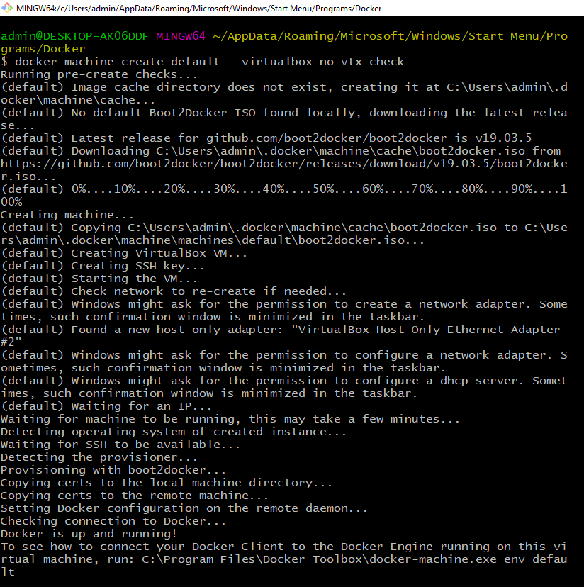

# Docker_Kubernetes 

**L'invite de commande est TOUJOURS celui de docker.exe**

Docker est:

* Flexible : même les applications les plus complexes peuvent être conteneurisées.
* Léger : les conteneurs exploitent et partagent le noyau hôte, ce qui les rend beaucoup plus efficaces en termes de ressources système que les machines virtuelles.
* Portable : vous pouvez créer localement, déployer sur le cloud et exécuter n'importe où.
* Couplage faible : les conteneurs sont hautement autonomes et encapsulés, vous permettant de remplacer ou de mettre à niveau l'un sans perturber les autres.
* Évolutif : vous pouvez augmenter et distribuer automatiquement des répliques de conteneurs dans un centre de données.
* Sécurisé : les conteneurs appliquent des contraintes agressives et des isolements aux processus sans aucune configuration requise de la part de l'utilisateur.

## Installation Docker desktop pour windows home

Activer la virtualisation:

- Faire Ctrl+Alt+Suppr > Gestionnaire de tache > Performance
- Puis controler le parametre de virtualisation.
- Si desactiver activer le dans votre bios, pour ma part equipe d'une carte mere MSI, je vais dans overclock > CPU feature > puis passe l'option SVM Mode à Enable.
- Allez à la racine de l'executable docker.exe est tapper la ligne de commande ci-dessous pour skip le check

	docker-machine create default --virtualbox-no-vtx-check
	

Verifier la version de votre docker

	docker --version

Ouvrir l'invitez de commande **docker**

	docker quickstart terminal.exe

Lister les machines

	docker-machine ls

Lister les containers:
	
	docker container ls -all

**Pour desinstaller** Docker il faut commencer par retirer toute les machine installé se reporter à https://docs.docker.com/toolbox/toolbox_install_windows/

## Demo

** Toujours dans l'invitez de commande docker**

1. Construire une image de votre projet: allez à la racine de votre projet et tapper:
	
	docker image build -t userName/Nom_de_projet:TAG
	
Exemple:

	docker image build -t jeanyvesruffin/projet_test:2
	
*Cela vas creer une image, au nom de Nom_de_projet*
	
2. Verifier la creation de l'image

Pour notre image:

	docker image ls userName/Nom_de_projet:TAG
	
3. Se connecter à votre container docker 

https://hub.docker.com/settings/general

Cliquer sur votre profil>Account Setting>Security>New Access Token. Indiquer une description ex: tokken_00

Puis executer les commandes demandées dans votre terminal.

4. Push sur le container distant

	docker image push jeanyvesruffin/docker_test:2

5. Tester votre application

	docker container run -d --name web -p 8000:8000 jeanyvesruffin/docker_test:2

## Docker command line

Consulter les container:

	docker container ls

Consulter les images:

	docker images
	
Supprimer une image, dans le nom_image bien specifier le tag et -f si besoin de forcer la suppression dans le cas ou cette image est utilisé:

	docker image rm <nom_image> -f
	
Exemple:

## Bug-fix:

Installation docker:

Installation Failed: one prerequisite is not fulfilled
Docker Desktop requires Windows 10 Pro or Enterprise version 15063 to run.

https://medium.com/@mbyfieldcameron/docker-on-windows-10-home-edition-c186c538dff3

https://docs.docker.com/toolbox/toolbox_install_windows/

Attention une configuration du bios est necessaire.
